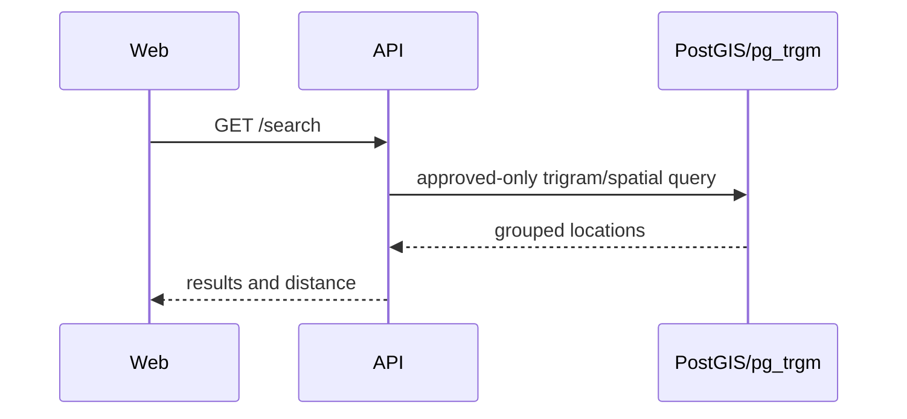
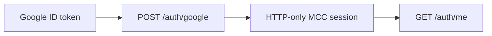
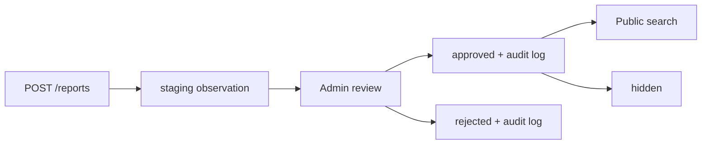
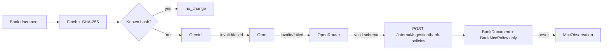
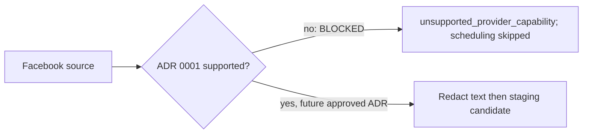
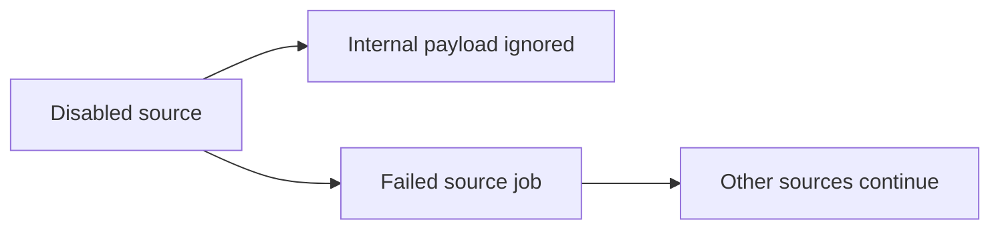

# Feature Flows

Last verified: 2026-08-05

```mermaid
sequenceDiagram
  participant W as Web
  participant A as API
  participant D as PostGIS/pg_trgm
  W->>A: GET /search
  A->>D: approved-only trigram/spatial query
  D-->>A: grouped locations
  A-->>W: results and distance
```

```mermaid
flowchart LR
  google["Google ID token"] --> auth["POST /auth/google"]
  auth --> session["HTTP-only MCC session"]
  session --> me["GET /auth/me"]
```

```mermaid
flowchart LR
  report["POST /reports"] --> staging["staging observation"]
  staging --> review["Admin review"]
  review --> approved["approved + audit log"]
  review --> rejected["rejected + audit log"]
  approved --> search["Public search"]
  approved --> hidden["hidden"]
```

```mermaid
flowchart LR
  bank["Bank document"] --> hash["Fetch + SHA-256"]
  hash --> unchanged{"Known hash?"}
  unchanged -->|yes| nochange["no_change"]
  unchanged -->|no| gemini["Gemini"]
  gemini -->|invalid/failed| groq["Groq"]
  groq -->|invalid/failed| openrouter["OpenRouter"]
  openrouter -->|valid schema| policy["POST /internal/ingestion/bank-policies"]
  policy --> bankdb["BankDocument + BankMccPolicy only"]
  bankdb -. never .-> observation["MccObservation"]
```

```mermaid
flowchart LR
  facebook["Facebook source"] --> gate{"ADR 0001 supported?"}
  gate -->|no: BLOCKED| unavailable["unsupported_provider_capability; scheduling skipped"]
  gate -->|yes, future approved ADR| redact["Redact text then staging candidate"]
```

```mermaid
flowchart LR
  source["Disabled source"] --> ignored["Internal payload ignored"]
  source --> failed["Failed source job"]
  failed --> isolated["Other sources continue"]
```
