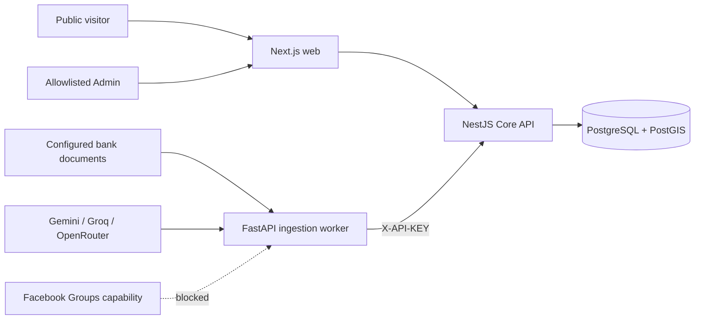
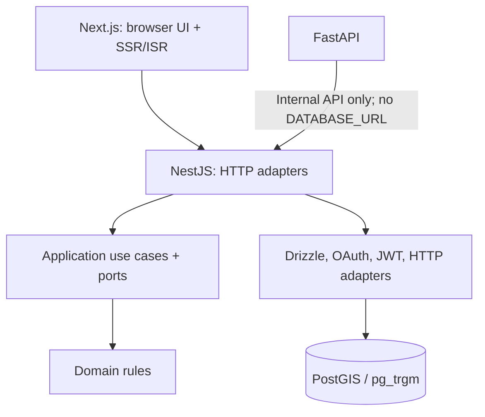
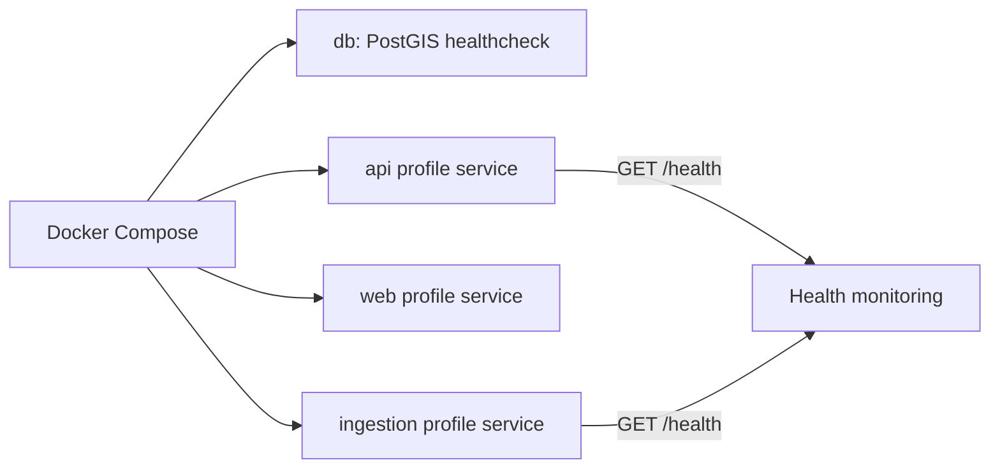

# System Overview

Last verified: 2026-08-05

```mermaid
flowchart LR
  visitor["Public visitor"] --> web["Next.js web"]
  admin["Allowlisted Admin"] --> web
  web --> api["NestJS Core API"]
  worker["FastAPI ingestion worker"] -->|"X-API-KEY"| api
  api --> db[("PostgreSQL + PostGIS")]
  banks["Configured bank documents"] --> worker
  llm["Gemini / Groq / OpenRouter"] --> worker
  meta["Facebook Groups capability"] -. blocked .-> worker
```

```mermaid
flowchart TB
  web["Next.js: browser UI + SSR/ISR"] --> api["NestJS: HTTP adapters"]
  api --> application["Application use cases + ports"]
  application --> domain["Domain rules"]
  api --> infrastructure["Drizzle, OAuth, JWT, HTTP adapters"]
  infrastructure --> db[("PostGIS / pg_trgm")]
  worker["FastAPI"] -->|"Internal API only; no DATABASE_URL"| api
```

```mermaid
flowchart LR
  compose["Docker Compose"] --> db["db: PostGIS healthcheck"]
  compose --> api["api profile service"]
  compose --> web["web profile service"]
  compose --> ingestion["ingestion profile service"]
  api -->|"GET /health"| health["Health monitoring"]
  ingestion -->|"GET /health"| health
```
