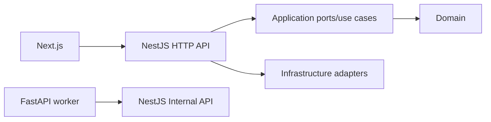

# Application Frameworks

Last verified: 2026-08-05

The MCC MVP monorepo separates browser UI, HTTP APIs, and ingestion work by framework so each service can evolve independently while sharing a single onboarding path.

## Official References

- [Next.js installation guide](https://nextjs.org/docs/app/getting-started/installation)
- [NestJS first steps](https://docs.nestjs.com/first-steps)
- [FastAPI first steps](https://fastapi.tiangolo.com/tutorial/first-steps/)

## Service Responsibilities

- `apps/web` is the Next.js App Router frontend. It owns browser rendering, public routes, and browser-safe environment variables.
- `apps/api` is the NestJS HTTP API. It owns external API routes, internal API routes, auth integration, and application orchestration. The bootstrap defaults to port `3001` so the local runtime matches `NEXT_PUBLIC_API_BASE_URL`.
- `services/ingestion` is the FastAPI ingestion worker. It redacts source text, validates normalized candidates, and calls the NestJS Internal API using `X-API-KEY`.

## Official Scaffold Commands

```powershell
pnpm dlx create-next-app@latest apps/web --typescript --eslint --app --no-src-dir --use-pnpm --import-alias "@/*"
pnpm dlx @nestjs/cli@latest new apps/api --package-manager pnpm --skip-git --strict
```

## Daily Commands

### Next.js (`apps/web`)

- Start: `pnpm --filter web dev`
- Build: `pnpm --filter web build`
- Typecheck: `pnpm --filter web typecheck`
- Lint: `pnpm --filter web lint`

### NestJS (`apps/api`)

- Start: `pnpm --filter api dev`
- Build: `pnpm --filter api build`
- Typecheck: `pnpm --filter api typecheck`
- Lint: `pnpm --filter api lint`

### FastAPI (`services/ingestion`)

- Create the required Python 3.12 environment:

  ```powershell
  py -3.12 -m venv .venv
  .\.venv\Scripts\Activate.ps1
  python -m pip install --upgrade pip
  python -m pip install -e services/ingestion
  ```

- Start: `python -m uvicorn app.main:app --app-dir services/ingestion --host 127.0.0.1 --port 8000`
- Build: `python -m compileall services/ingestion`
- Typecheck: `python -m mypy services/ingestion`
- Lint: `python -m ruff check services/ingestion`
- Health check: `Invoke-RestMethod http://127.0.0.1:8000/health`

## Dependency Direction



## Boundary Rules

- The web app talks to the API over HTTP and never reaches directly into database or ingestion concerns.
- The ingestion worker talks to the API through internal endpoints and never reaches into Next.js code.
- The worker must never receive `DATABASE_URL`; its only persistence boundary is the authenticated NestJS Internal API.
- Application and domain logic stay inside the API service boundary until later tasks extract shared libraries on purpose.
