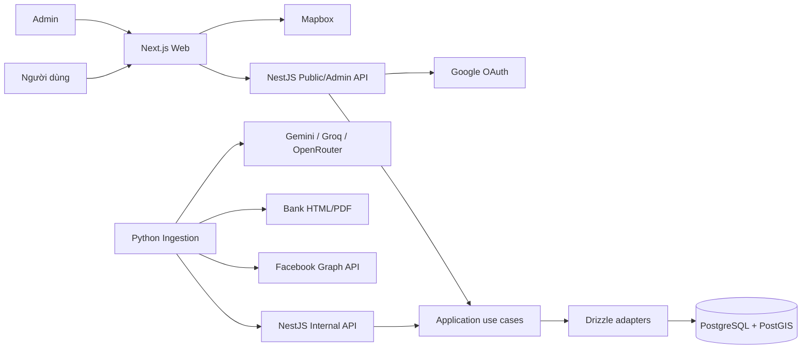
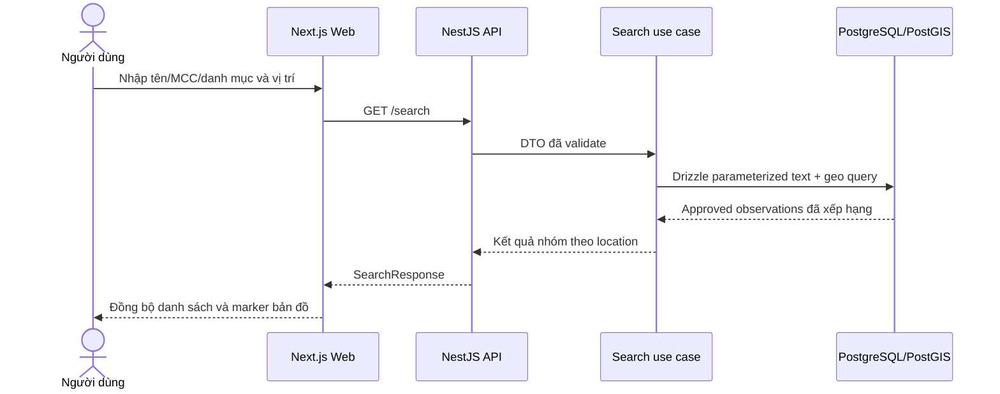
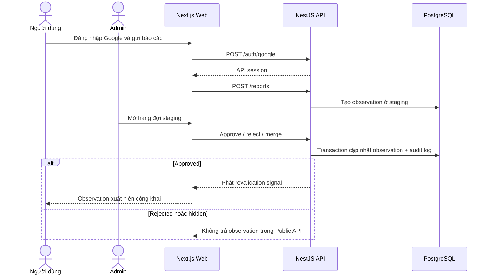
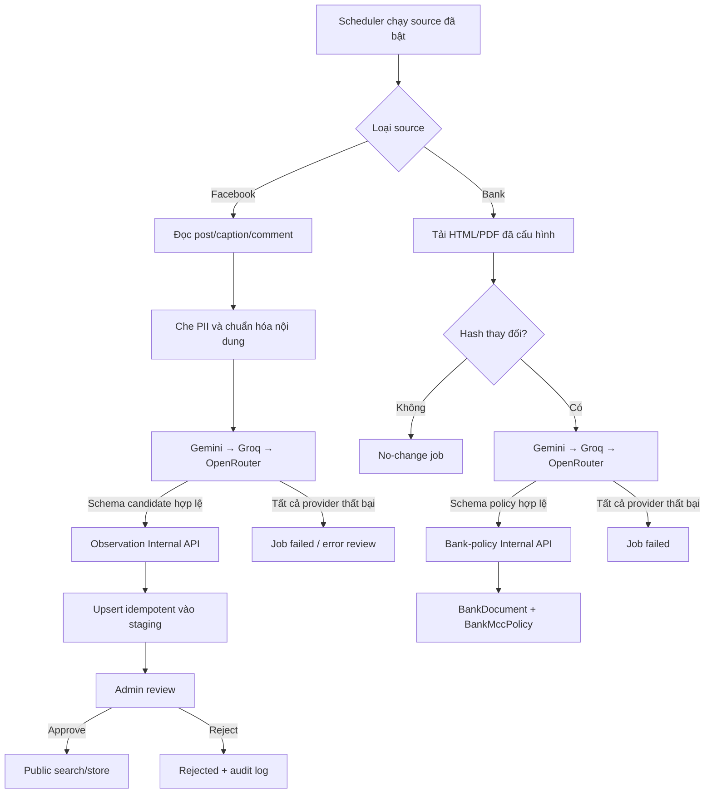
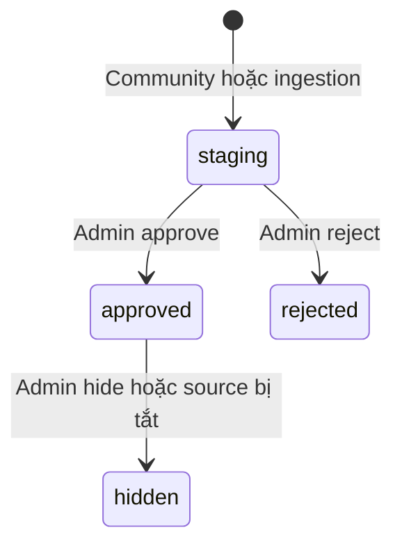

# MCC Map Vietnam — Thiết kế MVP

**Ngày:** 2026-08-01  
**Cập nhật:** 2026-08-02
**Trạng thái:** Đã duyệt

## 1. Mục tiêu và phạm vi

MVP là nền tảng tra cứu MCC thực tế của điểm mua sắm trên toàn Việt Nam. Người dùng tìm theo tên cửa hàng, MCC hoặc danh mục và vị trí; hệ thống hiển thị kết quả trên bản đồ cùng mức độ tin cậy. Dữ liệu bắt đầu bằng seed được duyệt và báo cáo cộng đồng, sau đó được làm giàu bằng ingestion thể lệ ngân hàng và các nhóm Facebook do chủ dự án cung cấp.

MVP phải đạt tối thiểu 5.000 địa điểm có tọa độ và 500 MCC observation đã duyệt. API tìm trong bán kính phải đáp ứng dưới 300 ms với khoảng 100.000 bản ghi.

Ngoài phạm vi MVP: gợi ý thẻ tín dụng tối ưu, upload ảnh hóa đơn/sao kê, OCR ảnh, social network ngoài Facebook, và phân quyền nhiều vai trò Admin.

## 2. Kiến trúc

Repository là monorepo gồm ba ứng dụng độc lập khi triển khai:

```text
apps/web                 Next.js: web công khai, SSR/ISR, Mapbox
apps/api                 NestJS: Public API, Admin API, OAuth, Internal API
services/ingestion       Python: nguồn ngân hàng, Facebook và LLM fallback
PostgreSQL + PostGIS     dữ liệu giao dịch, địa lý và tìm kiếm
```

`apps/web` gọi Public API của `apps/api`. `services/ingestion` không được truy cập PostgreSQL trực tiếp; nó gọi Internal API được xác thực bằng `X-API-KEY`. Điều này cho phép Python scale/deploy riêng, nhưng dữ liệu vẫn được DTO validation tại Core API.



### 2.1. Clean Architecture ở backend

NestJS tổ chức theo bốn lớp:

```text
domain/          entity, value object, business rule
application/     use case và interface/port
infrastructure/  Drizzle, PostgreSQL, Google OAuth, Mapbox, external clients
presentation/    REST controller, DTO, auth guard, exception mapping
```

Domain và application không import NestJS, Drizzle hay SDK bên thứ ba. Repository, geocoder, source reader, clock và ID generator được định nghĩa là port trong application; infrastructure triển khai các port đó. Controller chỉ map DTO vào use case. Quy tắc confidence, deduplication, entity resolution và duyệt dữ liệu nằm trong domain/application để thay thế database hoặc adapter mà không đổi nghiệp vụ.

Database adapter dùng `drizzle-orm` với driver `node-postgres`. Schema TypeScript nằm trong `apps/api/src/infrastructure/database/schema/`; `drizzle-kit` tạo và áp dụng migration. PostGIS, GiST, `pg_trgm`, GIN và các biểu thức SQL không được Drizzle biểu diễn đầy đủ sẽ dùng custom SQL migration được lưu cùng lịch sử migration. Spatial/fuzzy search dùng parameterized SQL thông qua Drizzle để giữ kiểm soát query plan và không nối chuỗi SQL từ input.

Python ingestion áp dụng nguyên tắc tương đương: use case chuẩn hóa/trích xuất chỉ phụ thuộc port; adapter triển khai từng nguồn, LLM client và Internal API client.

## 3. Mô hình dữ liệu

Đơn vị sự thật là `MccObservation`, không phải một MCC cố định của merchant.

```text
Merchant
  └─ MerchantLocation
       └─ MccObservation
```

- `merchant`: tên chuẩn, slug và loại merchant/chuỗi.
- `merchant_location`: chi nhánh, địa chỉ chuẩn hóa, tỉnh/thành, `geography(Point, 4326)` và trạng thái hoạt động.
- `merchant_alias`: descriptor/biến thể tên để entity resolution và fuzzy search.
- `mcc_code`: mã MCC, tên Việt/Anh và danh mục.
- `mcc_observation`: location hoặc merchant online, MCC, channel (`offline`/`online`), issuer bank/card network nếu biết, nguồn, thời điểm quan sát, confidence và trạng thái `staging`, `approved`, `rejected` hoặc `hidden`.
- `source`: loại nguồn, URL/ID ngoài hệ thống, trạng thái bật/tắt, lịch chạy, chính sách lưu giữ và cấu hình adapter không chứa secret.
- `source_item`: định danh và permalink nguồn, hash nội dung, snippet đã che PII, thời hạn lưu và metadata tối thiểu để Admin kiểm tra.
- `ingestion_job`: nguồn, thời điểm, trạng thái, thống kê, lỗi đã che dữ liệu nhạy cảm và idempotency key.
- `bank_document` và `bank_mcc_policy`: tài liệu ngân hàng cùng quy tắc MCC trích xuất; không được dùng để tự tạo MCC thực tế của điểm bán.
- `audit_log`: sự kiện Admin duyệt, từ chối, sửa, merge, ẩn hoặc chạy lại job.
- `user`: định danh Google, email và vai trò `user` hoặc `admin`.

PostgreSQL có PostGIS. `merchant_location.geo` dùng GiST; alias/tên có GIN `pg_trgm`. Các truy vấn công khai luôn lọc observation `approved`, phân trang và giới hạn bán kính.

## 4. Nguồn dữ liệu và ingestion

### 4.1. Báo cáo cộng đồng

Người dùng Google OAuth gửi bốn trường bắt buộc: cửa hàng/địa chỉ, MCC, ngân hàng phát hành và kênh thanh toán. Báo cáo luôn vào staging. Ảnh và OCR không thuộc MVP.

### 4.2. Facebook

Admin cấu hình các group do chủ dự án cung cấp. Chủ dự án chịu trách nhiệm xác nhận quyền truy cập/sử dụng với từng group và cung cấp token qua secret manager hoặc biến môi trường khi triển khai. Connector chỉ dùng API hợp lệ, đọc bài viết, caption và bình luận; không dùng scraper giao diện và không xử lý ảnh.

Connector lọc tín hiệu MCC, che PII trước khi xử lý, trích xuất candidate theo JSON schema, rồi tạo staging record có permalink và provenance. API capability không thay thế việc xác nhận quyền của Admin group. Khi tắt nguồn, connector dừng và các observation mang source đó có thể bị ẩn mà vẫn giữ audit trail theo chính sách lưu giữ.

### 4.3. Ngân hàng

Hằng ngày, adapter tải HTML/PDF từ VPBank, Techcombank, VIB, UOB, HSBC, Cake, Shinhan và TPBank; phát hiện thay đổi bằng hash. Nội dung được trích xuất thành `bank_mcc_policy` để phục vụ giai đoạn gợi ý thẻ sau này. Nó không được coi là bằng chứng merchant-to-MCC.

### 4.4. LLM và duyệt dữ liệu

LLM adapter gọi Gemini Free Tier, rồi Groq, rồi OpenRouter. Mỗi phản hồi phải khớp JSON schema. Lỗi mạng, hết quota, JSON sai schema hoặc thiếu merchant/MCC giữ item ở staging/error review; không có auto-publish.

Entity resolution đề xuất merchant/chi nhánh theo alias, địa chỉ và tọa độ. Admin đưa ra quyết định cuối cùng khi merge hoặc tạo mới. Confidence ban đầu dựa trên nguồn, độ đầy đủ, số quan sát độc lập trùng khớp và độ mới; confidence không tự kích hoạt công khai.

## 5. API

Public API:

- `GET /mcc-codes` và `GET /categories`
- `GET /search` với query, MCC/danh mục, tọa độ hoặc khu vực, bán kính và phân trang
- `GET /stores/:slug`
- `POST /reports`
- `POST /auth/google`

Admin API cung cấp hàng đợi staging, duyệt/từ chối, tạo/merge merchant location, ẩn observation, quản lý source, xem ingestion job và chạy lại source. Admin là vai trò duy nhất ở MVP; API kiểm tra email trên allowlist từ biến môi trường tại mọi endpoint Admin.

Internal API nhận normalized payload từ ingestion qua `X-API-KEY`, xác thực DTO, chạy use case upsert idempotent và trả về trạng thái xử lý. Không có API ingestion nào cho phép bỏ qua staging.

## 6. Trải nghiệm web

Trang tra cứu là map-first. Desktop hiển thị thanh tìm kiếm và filter ở đầu, danh sách kết quả cạnh bản đồ. Mobile dùng bản đồ toàn màn hình với bottom sheet kéo được cho danh sách kết quả. Tìm kiếm tên/MCC không cần GPS; truy vấn lân cận yêu cầu người dùng cho phép vị trí. Nếu không có GPS, người dùng chọn tỉnh/thành hoặc nhập địa chỉ.

Trang store dùng SSR/ISR và slug SEO. Trang hiển thị địa chỉ, map, MCC observation tách theo kênh, nguồn, thời điểm và mức tin cậy. Khi không có kết quả, UI mời người dùng gửi báo cáo MCC.

Khi Admin duyệt hoặc sửa observation, API phát revalidation signal để web làm mới trang store liên quan. Gợi ý thẻ không hiển thị ở MVP.

### 6.1. Luồng tìm kiếm công khai



### 6.2. Luồng báo cáo và duyệt dữ liệu



## 7. Lỗi, bảo mật và vận hành

Mỗi ingestion job có idempotency key. Lỗi của một source không ảnh hưởng source khác hoặc Public API. Job lưu trạng thái `failed` và thông tin lỗi đã che dữ liệu nhạy cảm; Admin có thể chạy lại.

Secret Facebook, LLM, database và Internal API chỉ tồn tại trong environment/secret manager, không có trong source, Git hoặc log. Public API validate input, rate limit, giới hạn bán kính/phân trang và không trả dữ liệu staging. Nội dung social lưu tối thiểu, che PII trước LLM và được xử lý theo retention policy của source.

Triển khai local dùng Docker Compose. Production tách web, API, ingestion; PostgreSQL backup định kỳ; mỗi service có health check và log cấu trúc.

### 7.1. Luồng ingestion và LLM fallback



### 7.2. Vòng đời observation



## 8. Tài liệu tài nguyên và tích hợp

MVP phải có bộ tài liệu onboarding có thể thực hiện tuần tự, không phụ thuộc vào kiến thức ngầm của người viết. Tài liệu được tổ chức như sau:

```text
docs/resources/README.md                  mục lục, thứ tự setup và readiness checklist
docs/resources/local-development.md       Node.js, pnpm, Python, Docker
docs/resources/database-and-drizzle.md    PostgreSQL, PostGIS, Drizzle ORM/Kit
docs/resources/mapbox.md                  account, token, map integration
docs/resources/google-oauth.md            OAuth consent, client ID/secret, redirect URI
docs/resources/facebook-graph-api.md      app, token, permission, group/source setup
docs/resources/llm-providers.md            Gemini, Groq, OpenRouter và fallback
docs/architecture/system-overview.md      container/dependency/deployment diagrams
docs/architecture/feature-flows.md        search, report, review, ingestion và lifecycle
```

Mỗi resource guide phải có:

1. Mục đích và vị trí của dependency trong MVP.
2. Điều kiện tiên quyết, phiên bản hoặc API version được xác nhận.
3. Các bước cài đặt local hoặc tạo account.
4. Các bước lấy key/credential và chọn quyền tối thiểu cần thiết.
5. Biến môi trường liên quan, dùng placeholder thay vì secret thật.
6. Các bước cấu hình provider console và tích hợp vào module/adapter của hệ thống.
7. Lệnh hoặc thao tác xác minh, kèm kết quả mong đợi.
8. Lỗi phổ biến, cách chẩn đoán và cách thu hồi/rotate credential.
9. Link tài liệu chính thức và ngày cuối cùng các bước được xác minh.

Tài liệu không được chứa token thật, ảnh chụp có secret, dữ liệu người dùng hoặc hướng dẫn vượt qua permission của provider. Khi triển khai task tích hợp, người thực hiện phải đối chiếu lại tài liệu chính thức vì dashboard, permission, API version và quy trình cấp key có thể thay đổi.

## 9. Kiểm tra chấp nhận thủ công

Theo yêu cầu, MVP không có unit, integration hay E2E test tự động. Trước bàn giao phải kiểm tra thủ công:

1. Tìm kiếm theo tên, MCC, danh mục, bán kính và fallback không GPS.
2. Đăng nhập Google và gửi report bắt buộc vào staging.
3. Admin duyệt/từ chối/merge; observation đã duyệt xuất hiện trên map và trang SEO.
4. Job ngân hàng/Facebook tạo staging; fallback LLM và JSON sai schema không làm rò dữ liệu công khai.
5. Tắt source ẩn đúng dữ liệu liên quan và giữ audit log.
6. Đo truy vấn PostGIS trên dữ liệu mẫu lớn, xác nhận mục tiêu latency.
7. Một developer mới có thể đi theo `docs/resources/README.md`, khởi động local stack, tạo/cấu hình credential bằng placeholder hoặc test credential, và hoàn thành từng bước verify.
8. Mermaid diagram render hợp lệ và phản ánh đúng API, trạng thái dữ liệu cùng ranh giới service trong implementation.

## 10. Tiêu chí hoàn thành MVP

- Ít nhất 5.000 merchant location có tọa độ trên toàn Việt Nam.
- Ít nhất 500 MCC observation ở trạng thái `approved`.
- Tám ngân hàng có source registry và ingestion policy.
- Social ingestion cho các group do chủ dự án cấu hình.
- Search map-first, report cộng đồng, Admin staging review và SEO store page hoạt động.
- Bộ resource guide và sơ đồ Mermaid được hoàn thành, liên kết từ README và đã kiểm tra theo onboarding checklist.
